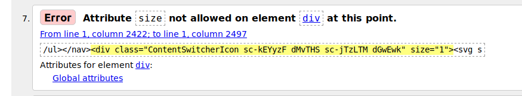
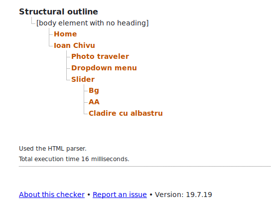
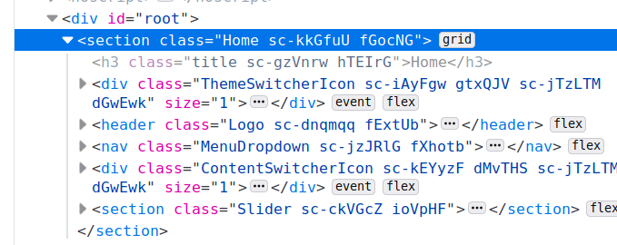
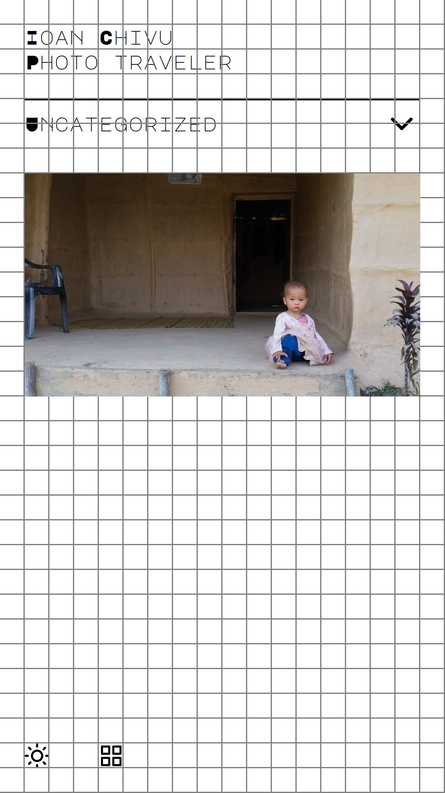
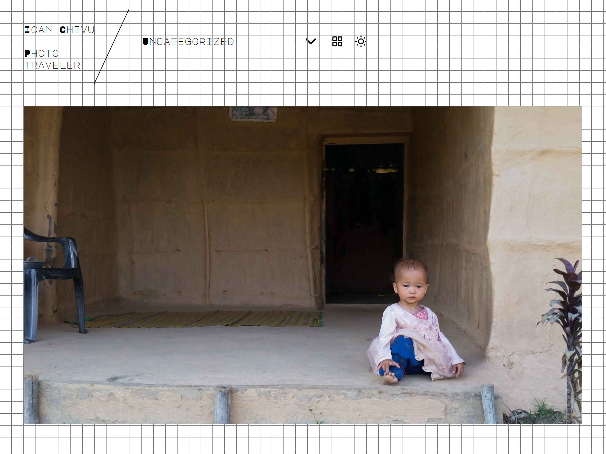

# inu-v2-b

A photo portfolio theme with React, WPGraphQL and Create React WPTheme.

## Development process

Based on [Thinking in React](https://reactjs.org/docs/thinking-in-react.html).

### Theme - v0.0.5

1. Illegal HTML attributes / props should be eliminated.

   - 

   - This happens when reserved prop names are added to components. See list of all reserved attributes: https://developer.mozilla.org/en-US/docs/Web/HTML/Attributes

2. Presentational (Reusable Web) components should be semantically valid in the W3C checker.

3. Container (Non-reusable, project specific) components which holds the business logic should be fragments. This way the `divism` is highly reduced and the layout can be easily sketched with CSS Grid.

4. All elements should be aligned to the grid both vertically and horizontally.

