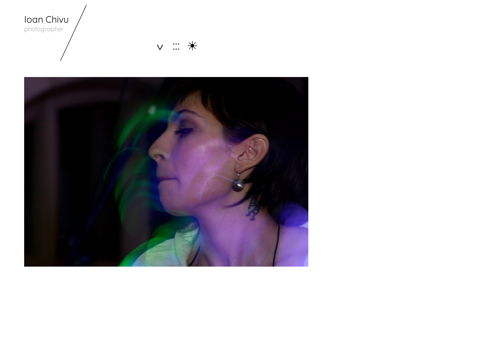
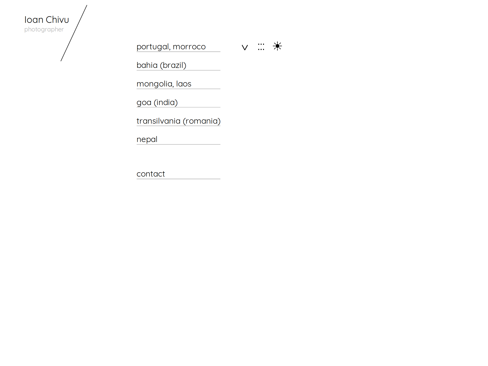
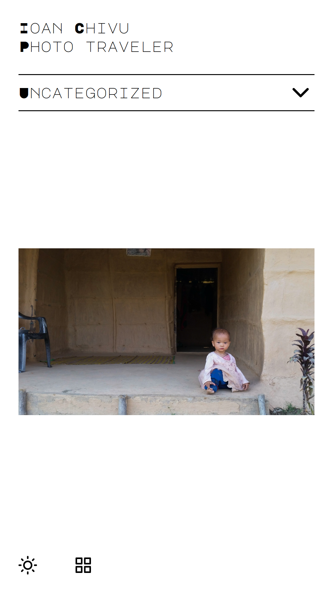
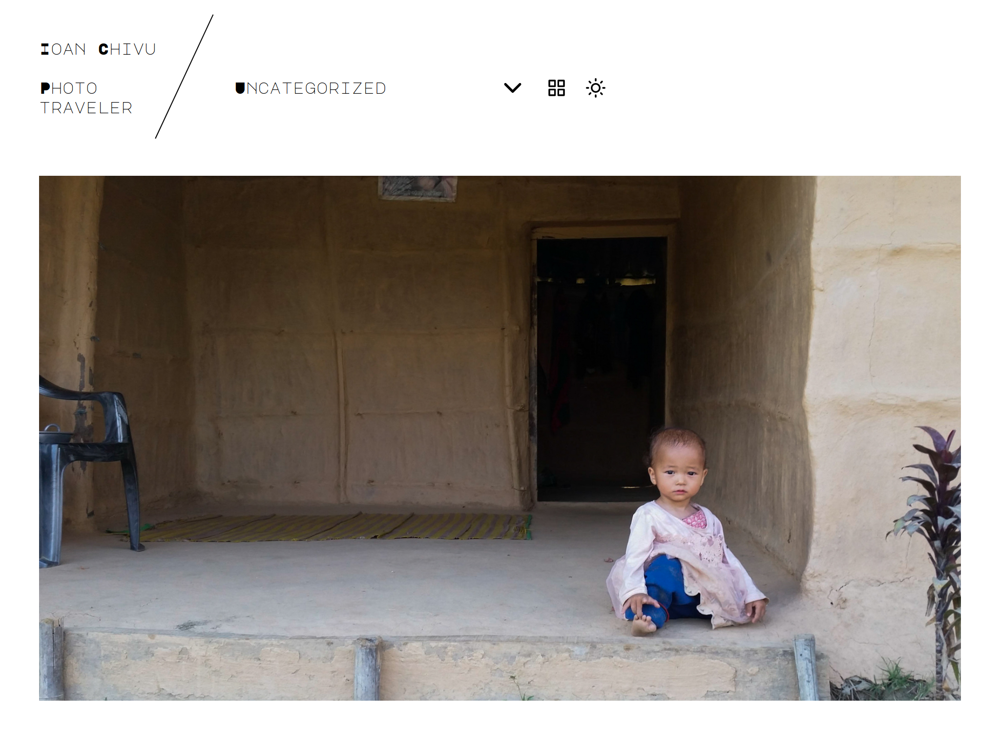
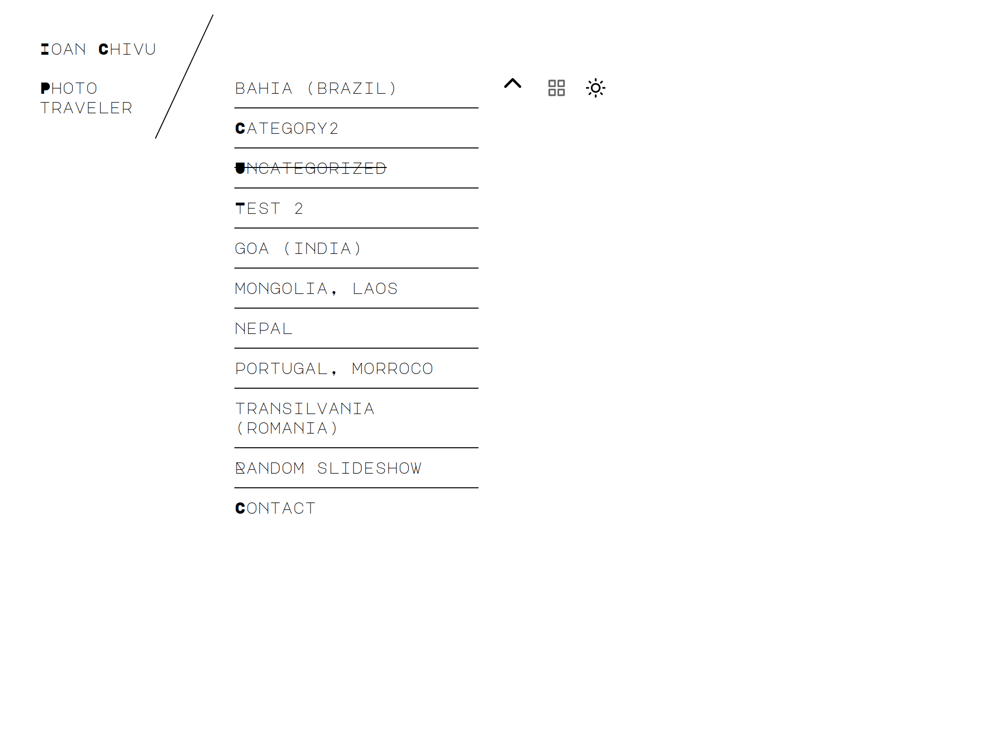
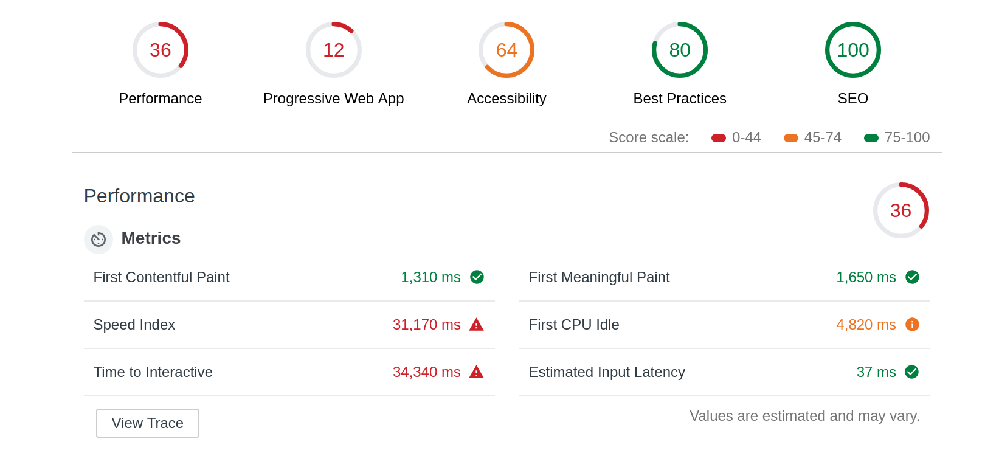
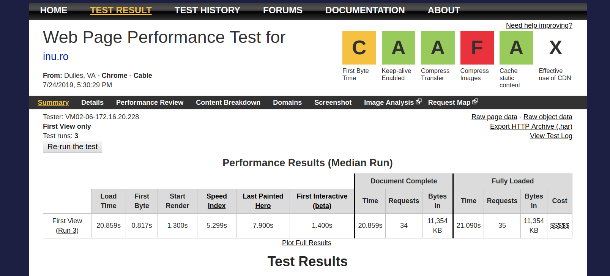
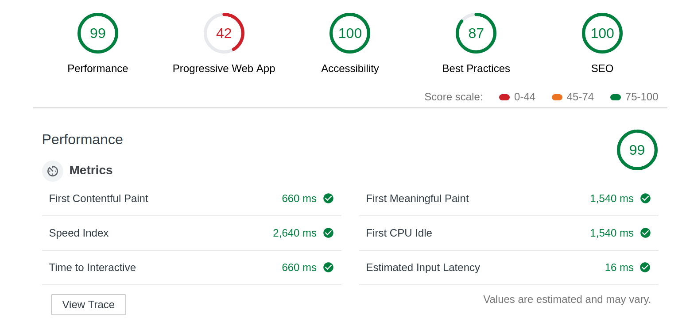

# inu-v2-b

A photo portfolio theme with React and WordPress.

## Contents

<!-- START doctoc generated TOC please keep comment here to allow auto update -->
<!-- DON'T EDIT THIS SECTION, INSTEAD RE-RUN doctoc TO UPDATE -->

- [Prerequisites](#prerequisites)
- [Requirements](#requirements)
- [Deliverables](#deliverables)
- [Features](#features)
  - [Backend](#backend)
  - [Frontend](#frontend)
  - [Design](#design)
- [Development process](#development-process)
  - [Mocks - v0.0.1](#mocks---v001)
  - [Static content (a.k.a data)- v0.0.2](#static-content-aka-data--v002)
  - [Interaction - v0.0.3](#interaction---v003)
  - [Refactoring - v0.0.4](#refactoring---v004)
  - [Theme - v0.0.5](#theme---v005)
  - [Performance - v0.0.6](#performance---v006)
  - [Best practices checklist - v0.0.7](#best-practices-checklist---v007)
  - [Documentation - v0.0.8](#documentation---v008)
  - [Live Test - v0.0.9](#live-test---v009)
- [Results](#results)
  - [The old site look](#the-old-site-look)
  - [The new site look](#the-new-site-look)
  - [The old site performance](#the-old-site-performance)
  - [The new site performance](#the-new-site-performance)
- [Known issues](#known-issues)
- [Changelog](#changelog)
  - [[0.1.2] - 2019-08-12](#012---2019-08-12)
  - [[0.1.1] - 2019-08-06](#011---2019-08-06)
  - [[0.1.0] - 2019-08-01](#010---2019-08-01)

<!-- END doctoc generated TOC please keep comment here to allow auto update -->

## Prerequisites

The old [inu.ro](http://inu.ro) design is dated back spring 2014. It's time for a refresh.

The slider on mobile screens was confusing: on click the slide disappeared and the next photo was sliding in. This had to be fixed.

## Requirements

1. Keep the same simple design.
2. Keep the black/white background switcher.
3. Fix the slider on mobile screens.
4. Add a random slideshow.
5. Make categories display order changeable on the backend.
6. Keep the WordPress backend.
7. Refresh the front-end stack and make it future friendly for another couple of years.
8. Enhance page load performance.

## Deliverables

- The new site: http://inu.ro
- The source code: https://github.com/metamn/inu-v2-b
- The styleguide: http://inu.ro/styleguide
- The component guide and the API documentation: http://metamn.io/inu-v2-b/
- A blog post: http://metamn.io/react/thoughts-on-react-after-the-first-commercial-project/

## Features

The following features were added:

### Backend

- WordPress updated to Gutenberg.
- [Category Order and Taxonomy Terms Order](https://www.nsp-code.com/wordpress-plugins/category-order-and-taxonomy-terms-order/) plugin added.
- Support for multiple ways to add photos:
  - As a featured image.
  - Inserted into the post.
  - As associated media to the post.

### Frontend

- React Single Page Application with function components and hooks.
- WordPress theming with [create-react-wptheme](https://github.com/devloco/create-react-wptheme)
- GraphQL with [WP GraphQL](https://www.wpgraphql.com/) and [@apollo/react-hooks](https://www.apollographql.com/docs/tutorial/queries/#the-usequery-hook)
- [styled-components](https://www.styled-components.com/) for styling.
- Prop types for static type checking.
- Query fragments.
- Complete API/JSDoc documentation.

### Design

- Component based design with [Storybook](https://storybook.js.org/).
- Design documentation with a custom made styleguide.
- New technologies wherever possible:

  - `CSS Grid` layout
  - `CSS scroll-snap` for sliding images inspired by [Google Developers](https://developers.google.com/web/updates/2018/07/css-scroll-snap)

## Development process

A short overview of the major steps and tasks done. It is completely based on [Thinking in React](https://reactjs.org/docs/thinking-in-react.html) with each step separated into a feature branch. Every branch goes into deeper details in its README.md.

### Mocks - [v0.0.1](https://github.com/metamn/inu-v2-b/tree/v0.0.1-mock)

1. Mocking up the component structure and the functionality
2. Adjusting component structure to the WP GraphQL API
3. Applying the single responsibility principle
4. Create requirement specification

### Static content (a.k.a data)- [v0.0.2](https://github.com/metamn/inu-v2-b/tree/v0.0.2-data)

1. Building up the data components.
2. Continuing with other (presentational) components.
3. Creating additional components when necessary. Like `MenuItem` for `Menu`.
4. Focusing on content and data. Any new ideas are added as Github Issues to be implemented later.

### Interaction - [v0.0.3](https://github.com/metamn/inu-v2-b/tree/v0.0.3-interaction)

1.  Going through each component which is handling interactive elements and implement their functionality. Usually with states.
2.  Connect states together and lifting state up.

### Refactoring - [v0.0.4](https://github.com/metamn/inu-v2-b/tree/v0.0.4-refactoring)

1. Make sure all components satisfy the Single Responsibility Principle (SRP).
2. Separate reusable components (for web, for WordPress) from project specific components.

### Theme - [v0.0.5](https://github.com/metamn/inu-v2-b/tree/v0.0.5-theme)

1. Presentational (reusable web) components should be semantically valid in the W3C checker.
2. Container (non-reusable, project specific) components which holds the business logic should be fragments. This way the `divism` is highly reduced and the layout can be easily sketched with CSS Grid.
3. All elements should be aligned to the typographic grid both vertically and horizontally.

### Performance - [v0.0.6](https://github.com/metamn/inu-v2-b/tree/v0.0.6-performance)

1. Database queries were lifted up to the highest level. This way the minimum amount of queries are performed only.
2. A new slider had to be added. The old slider triggered too many re-renders.

### Best practices checklist - [v0.0.7](https://github.com/metamn/inu-v2-b/tree/v0.0.7-checklist)

1. Testing the dev version only. After deployment the live (staging) site will be more thoroughly tested.

### Documentation - [v0.0.8](https://github.com/metamn/inu-v2-b/tree/v0.0.8-documentation)

1. Developer docs created (this README.md).
2. Components documented with Storybook.
3. API documented with JSDoc, JSDoc2Markdown and added to Storybook as Notes.
4. Theme / style / design decisions documented with a handmade styleguide.

### Live Test - [v0.0.9](https://github.com/metamn/inu-v2-b/tree/v0.0.9-test)

1. Testing live on multiple devices and browsers.

```
| Device / OS | iOS *| Android *| Ubuntu *| Windows *| MacOS *|
---------------------------------------------------------------
| Phone       | [1]  | 🆗       | n/a     | n/a      | n/a     |
| Tablet      | [1]  | 🆗       | n/a     | n/a      | n/a     |
| Desktop     | n/a  | n/a      | 🆗      | [2]      | ...     |

[1] The slider flicks on touch scroll. This is an [official bug](https://github.com/metamn/inu-v2-b/issues/24)

[2] Doesn't works at all in Internet Explorer.

🆗 Works in:
* iOS browsers: Safari
* Android browsers: Chrome
* Ubuntu browsers: Firefox, Chrome, Opera
* Windows browsers: Chrome, Firefox, Edge
```

2. Re-testing for best practices.

See screenshots below with results.

### Performance - [v0.1.2](https://github.com/metamn/inu-v2-b/tree/v0.1.2-performance)

Implement best practices (continuously collected) to enhance performance. Such:

1. Wrap all business logic into a [`UseEffect`](https://overreacted.io/writing-resilient-components/#dont-stop-the-data-flow-in-side-effects)

2. Wrap expensive function calls into [`useMemo`](https://overreacted.io/writing-resilient-components/#dont-stop-the-data-flow-in-rendering)

3. Stress-test the whole app: https://overreacted.io/writing-resilient-components/#principle-3-no-component-is-a-singleton

4. Avoid making a local state global: https://overreacted.io/writing-resilient-components/#principle-4-keep-the-local-state-isolated

5. Reduce re-renders

Couldn't manage it. All examples [1](https://www.robinwieruch.de/react-hooks-fetch-data/) [2](https://itnext.io/usefetch-react-custom-hook-for-fetch-api-with-suspense-and-concurrent-mode-in-mind-1d3ba9250e0) are using the async / axios way which isn't compatible with the `useQuery` approach from Apollo where a `loading` result is immediately returned - which cannot be memoized, set as state etc ...

Still to research ... the solution lies somewhere in `apolloClient` / `<ApolloProvider>`

6. Suspense

The functionality is already implemented either by displaying default data (Site info, Categories) or with the fade in technique (Content) and works pretty well ...

## Results

### The old site look

> 

> 

> 

### The new site look

> 

> 

> 

### The old site performance

> 

> 

### The new site performance

> 

> 

## Known issues

- Safari / iOS scroll bug: https://github.com/metamn/inu-v2-b/issues/24

## Changelog

All changes to the project are documented here using the [Keep a Changelog](https://keepachangelog.com/en/1.0.0/) format and [semantic versioning](https://semver.org/spec/v2.0.0.html).

### [0.1.2] - 2019-08-12

#### Added

- A few memoizations where they were appropiate.

#### Changed

- `react-apollo-hooks` to `@apollo/react-hooks`

#### Fixed

- Grouping images into '/images'. See https://github.com/metamn/inu-v2-b/issues/31

### [0.1.1] - 2019-08-06

#### Fixed

- Storybook issue https://github.com/metamn/inu-v2-b/issues/26

### [0.1.0] - 2019-08-01

This is the first official release.
