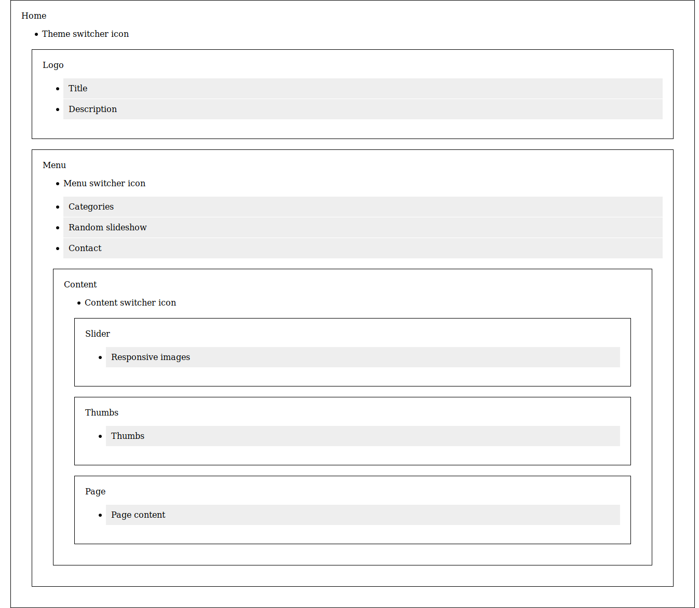
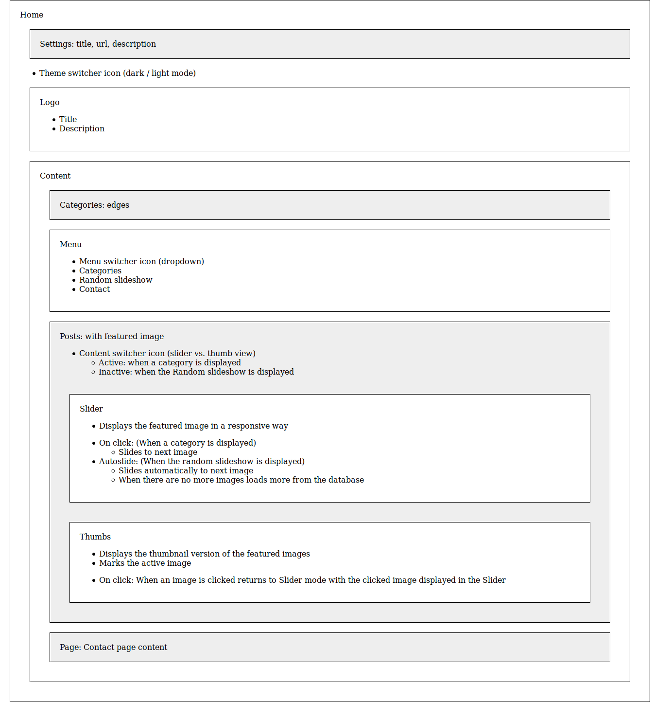
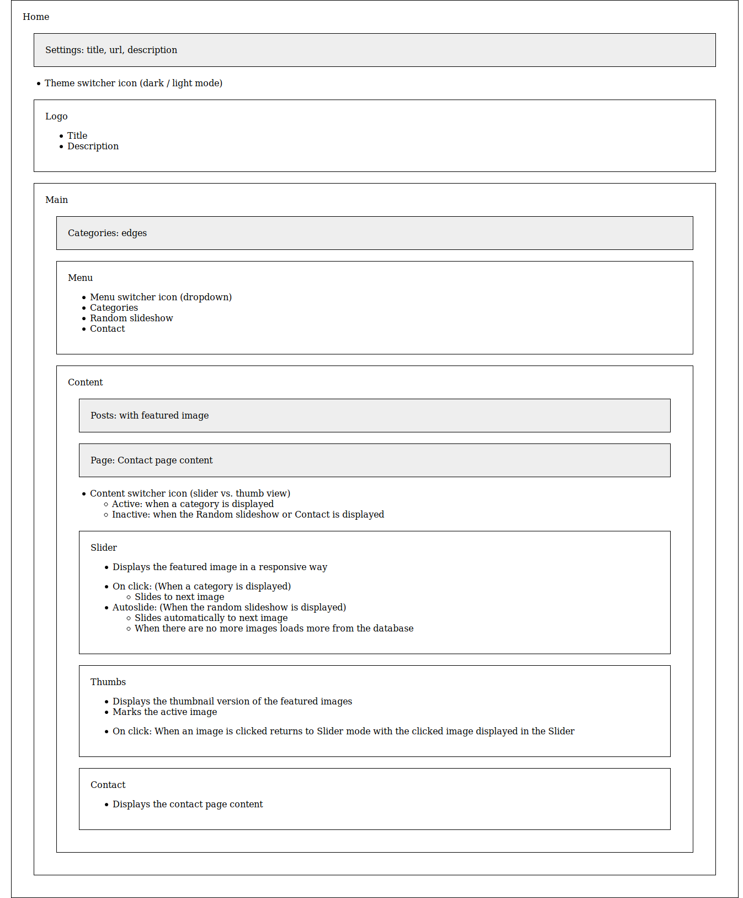
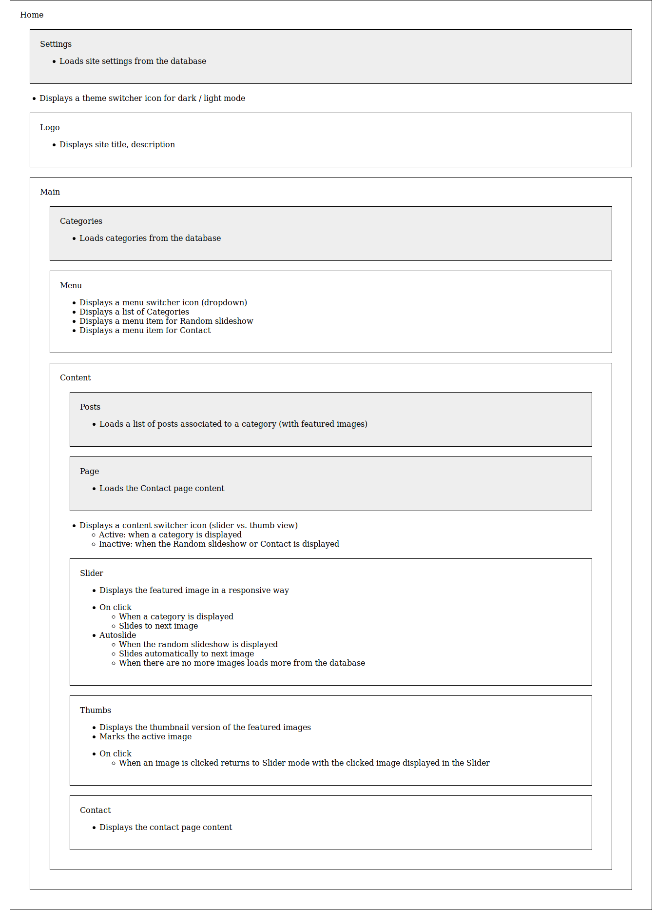
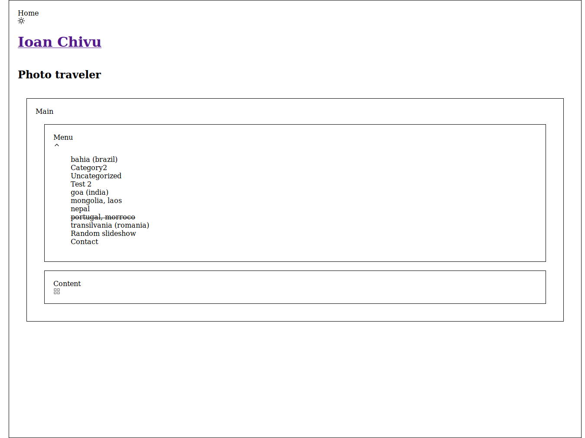
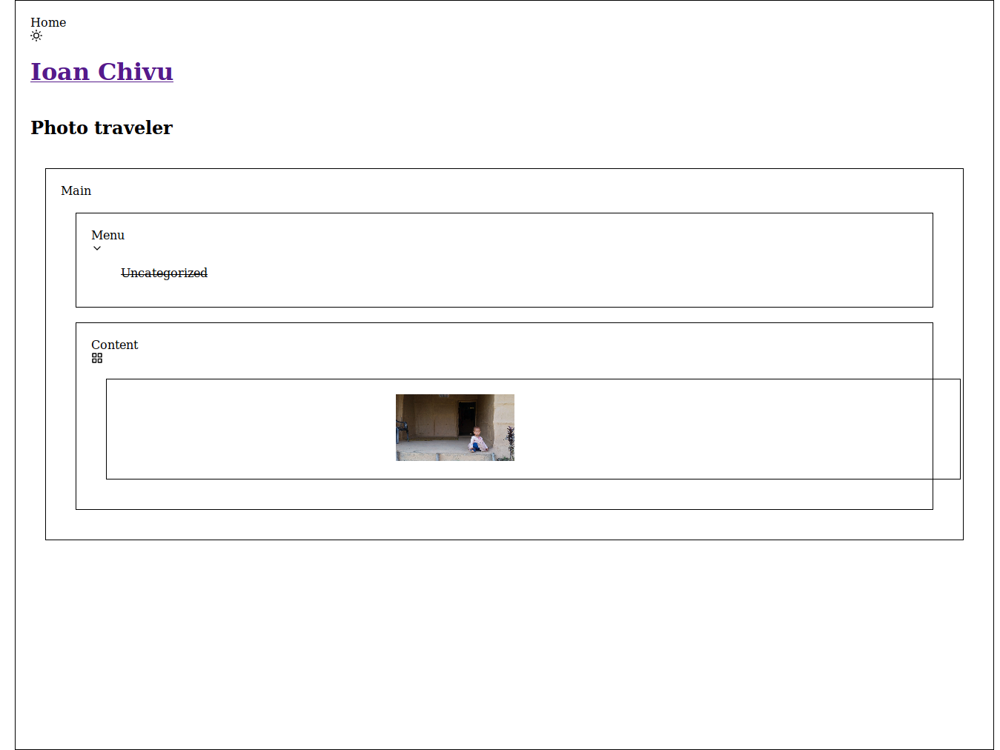
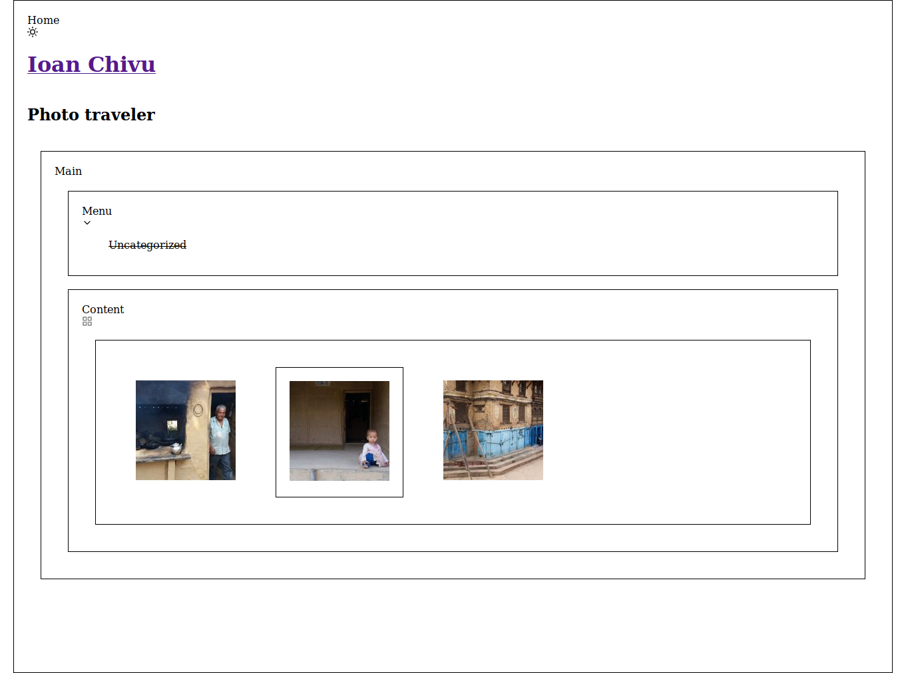

# inu-v2-b

A photo portfolio theme with React, WPGraphQL and Create React WPTheme.

## Development process

Based on [Thinking in React](https://reactjs.org/docs/thinking-in-react.html).

### Theme - v0.0.5

### Mocks - v0.0.1

1. Mocking up the component structure and the functionality



2. Adjusting component structure to the WP GraphQL API



3. Applying the single responsibility principle



4. Create requirement specification

With a little text cleanup the requirement specification is done!



### Static content (a.k.a data)- v0.0.2

- Start building up every component.
- From bottom to top starting with standalone components.
- Focus on props only, default values and _skip states_.
- Skip the UI/UX design part. Leave it as it is. Don't do theming. Default props should work.
- Check components also in Storybook.
- Leave no warnings in the console log.

1. Start with data components.
2. Continue with other (presentational) components.
3. Create additional components when necessary. Like `MenuItem` for `Menu`.
4. Don't fully implement all the features at this stage. Instead create Github Issues for later reuse.


### Interaction - v0.0.3

1.  Go through each component which is handling interactive elements and implement their functionality. Usually with states.

    1.  To check if something is a state [answer these questions](https://reactjs.org/docs/thinking-in-react.html) and fill the table below. All answers must be `No` to make a candidate a state:

    ```
    | State candidate          | Props | Unchanged | Computable |
    -------------------------------------------------------------
    | state                    | No    | No        | No         |
    | ....                     | No    | No        | No         |
    ```

    2.  When adding state try to maintain some naming conventions. Like:

        1. `active` should mark a state. Ex.: `activeTheme`, `activeImage`, `activeMenuItem`. `current` should not mark a state.
        2. `State` suffix should be used where appropriate. Like `menuSwitcherIconState`.

    3.  Try to `useContext` to pass state when it will be consumed down deep in the tree.

2.  Connect states together. One state change might trigger another state changes. Connecting states usually changes the owner component of a state. To find the component which best owns a state (lifting state) this table can help:

```
| State                    | Home component | Other comps using the state | Common owner above |
------------------------------------------------------------------------------------------------
| state                    |                |                             |                    |
```

3. The generated docs should include implementations of every feature / requirement specification declared in previous stages. More, if tests were used from beginning this task now would be obvious.

#### Example

After implementing states (1.) we had:

```
| State candidate          | Props | Unchanged | Computable |
-------------------------------------------------------------
| activeTheme              | No    | No        | No         |
| activeMenuItem           | No    | No        | No         |
| menuSwitcherIconState    | No    | No        | No         |
| activeContentDisplayMode | No    | No        | No         |
| activeImage              | No    | No        | No         |
```

```
| State                    | Home component | Other comps using the state | Common owner above |
------------------------------------------------------------------------------------------------
| activeTheme              | Home           | Many, with `useContext`     | n/a                |
| activeMenuItem           | Main           | Content, MenuItem           | n/a                |
| menuSwitcherIconState    | Menu           | n/a                         | n/a                |
| activeContentDisplayMode | Content        | Thumbs                      | n/a                |
| activeImage              | Content        | Thumbs, Slider              | n/a                |
```

After connecting states (2.) we had:

```
| State                    | Home component | Other comps using the state | Common owner above |
------------------------------------------------------------------------------------------------
| activeTheme              | Home           | Many, with `useContext`     | n/a                |
| activeMenuItem           | Main           | Content, MenuItem           | n/a                |
| menuSwitcherIconState    | Main           | n/a                         | n/a                |
| activeContentDisplayMode | Main           | Thumbs                      | n/a                |
| activeImage              | Content        | Thumbs, Slider              | n/a                |
```

### Screenshots







### Refactoring - v0.0.4

This is an intermediary step necessary to make sure all components satisfy the Single Responsibility Principle (SRP). Being my first React project I don't feel 100% confident all components are as slim as they should be at this stage.

The idea is to take every component, think about it as a single entity, separate from the rest of the project via Storybook and clean it up. Then connect back to the whole.

The aim is to have a set of reusable components (in other web projects, in other WordPress backed projects) and a set of project specific, non-reusable components.

Reusable components stay as thin as possible, project specific components can be heavy. Perhaps reusable components should be adapted back to the project via Context instead of adding lots of project specific props.

```
| Reusable components | Web                              | WordPress
----------------------------------------------------------------------------------------
|                     | Icon, IconToggle, Image,         | Category, Categories, Page, |
|                     | ImageResponsive, MenuDropdown,   | Pages, Post, Posts,         |
|                     | MenuItem, Meta, PlaceholderImage,| PostFeaturedImage, Settings |
|                     | SemanticHTML, Slide, Slides,     |                             |
|                     | Slider, Thumb, Thumbs            |                             |
----------------------------------------------------------------------------------------
|Non-reusable         | Project specific                 |                             |
----------------------------------------------------------------------------------------
|                     | Contact, Content, Home, Logo,    |                             |
|                     | Main, Menu                       |                             |
```
