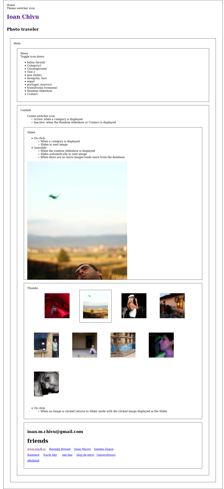

# inu-v2-b

A photo portfolio theme with React, WPGraphQL and Create React WPTheme.

## Development process

Based on [Thinking in React](https://reactjs.org/docs/thinking-in-react.html).

### Static content (a.k.a data)- v0.0.2

- Start building up every component.
- From bottom to top starting with standalone components.
- Focus on props only, default values and _skip states_.
- Skip the UI/UX design part. Leave it as it is. Don't do theming. Default props should work.
- Check components also in Storybook.
- Leave no warnings in the console log.

1. Start with data components.
2. Continue with other (presentational) components.
3. Create additional components when necessary. Like `MenuItem` for `Menu`.
4. Don't fully implement all the features at this stage. Instead create Github Issues for later reuse.

