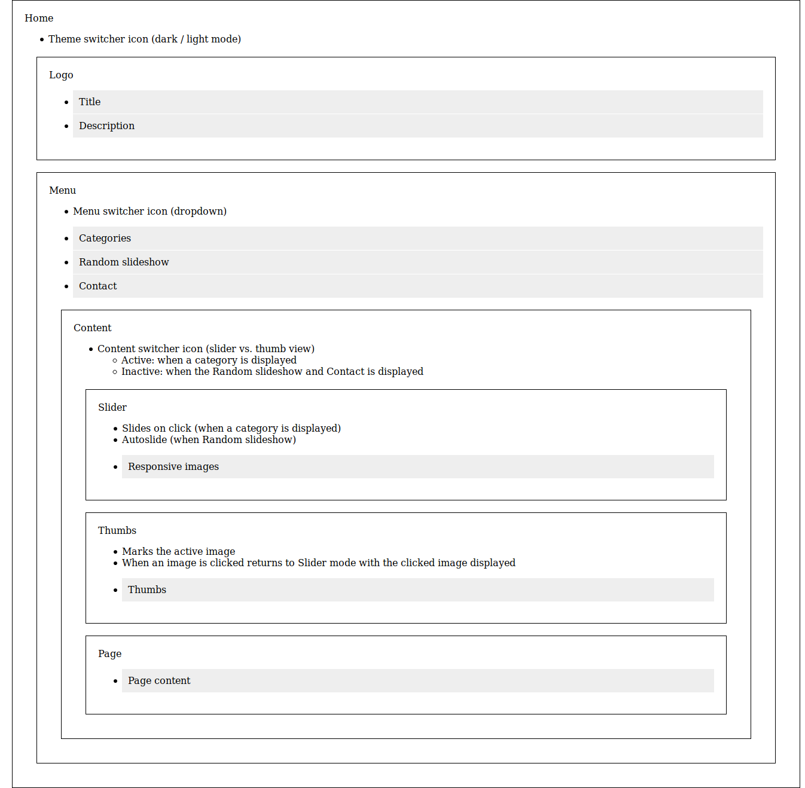

# inu-v2-b

A photo portfolio theme with React, WPGraphQL and Create React WPTheme.

## Development process

Based on [Thinking in React](https://reactjs.org/docs/thinking-in-react.html).

### Mocks - v0.0.1

Note: Items with gray background represents data.

1. Mocking up the component structure and the functionality

2. Adjusting component structure to the WP GraphQL API

3. Applying the single responsibility principle

