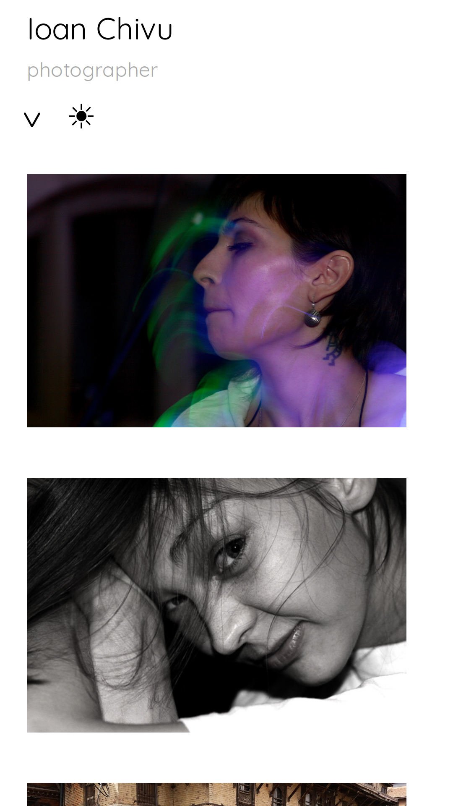
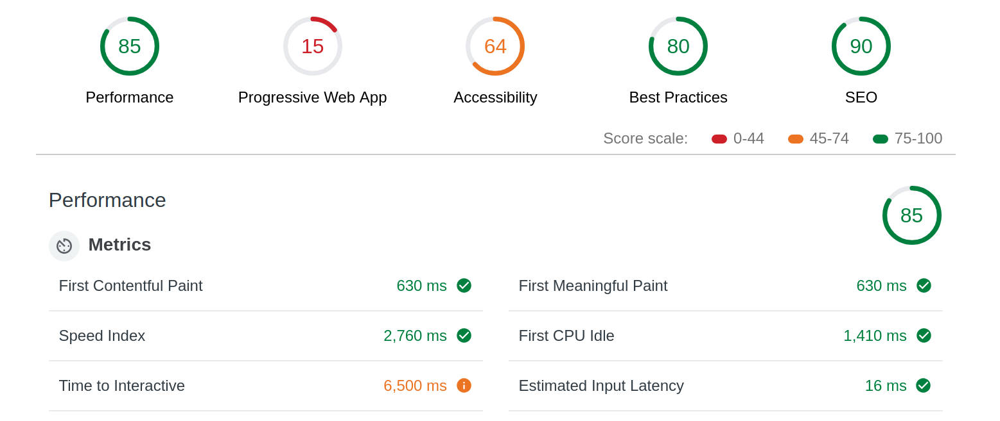
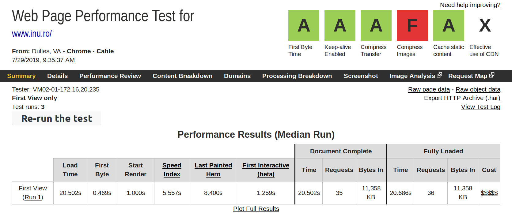

# inu-v2-b

A photo portfolio theme with React and WordPress.

## Contents

<!-- START doctoc generated TOC please keep comment here to allow auto update -->
<!-- DON'T EDIT THIS SECTION, INSTEAD RE-RUN doctoc TO UPDATE -->

- [Prerequisites](#prerequisites)
- [Requirements](#requirements)
- [Deliverables](#deliverables)
- [Features](#features)
  - [Backend](#backend)
  - [Frontend](#frontend)
  - [Design](#design)
- [Development process](#development-process)
  - [Mocks - v0.0.1](#mocks---v001)
  - [Static content (a.k.a data)- v0.0.2](#static-content-aka-data--v002)
  - [Interaction - v0.0.3](#interaction---v003)
  - [Refactoring - v0.0.4](#refactoring---v004)
  - [Theme - v0.0.5](#theme---v005)
  - [Performance - v0.0.6](#performance---v006)
  - [Best practices checklist - v0.0.7](#best-practices-checklist---v007)
  - [Documentation - v0.0.8](#documentation---v008)
- [Results](#results)
  - [The old site look](#the-old-site-look)
  - [The new site look](#the-new-site-look)
  - [The old site performance](#the-old-site-performance)
  - [The new site performance](#the-new-site-performance)
- [Changelog](#changelog)

<!-- END doctoc generated TOC please keep comment here to allow auto update -->

## Prerequisites

The old [inu.ro](http://inu.ro) design is dated back spring 2014. It's time for a refresh.

The slider on mobile screens was confusing: on click the slide disappeared and the next photo was sliding in. This had to be fixed.

## Requirements

1. Keep the same simple design.
2. Keep the black/white background switcher.
3. Fix the slider on mobile screens.
4. Add a random slideshow.
5. Make categories display order changeable on the backend.
6. Keep the WordPress backend.
7. Refresh the front-end stack and make it future friendly for another couple of years.
8. Enhance page load performance.

## Deliverables

- The new site: http://inu.ro
- The component guide and the API documentation: http://metamn.io/inu-v2-b-storybook
- The styleguide: http://inu.ro/styleguide
- The source code: https://github.com/metamn/inu-v2-b

## Features

The following features were added:

### Backend

- WordPress updated to Gutenberg.
- [Category Order and Taxonomy Terms Order](https://www.nsp-code.com/wordpress-plugins/category-order-and-taxonomy-terms-order/) plugin added.
- Support for multiple ways to add photos:
  - As a featured image.
  - Inserted into the post.
  - As associated media to the post.

### Frontend

- React Single Page Application with function components and hooks.
- WordPress theming with [create-react-wptheme](https://github.com/devloco/create-react-wptheme)
- GraphQL with [WP GraphQL](https://www.wpgraphql.com/) and [react-apollo-hooks](https://github.com/trojanowski/react-apollo-hooks)
- [styled-components](https://www.styled-components.com/) for styling.
- Prop types for static type checking.
- Query fragments.
- Complete API/JSDoc documentation.

### Design

- Component based design with [Storybook](https://storybook.js.org/).
- Design documentation with a custom made styleguide.
- New technologies wherever possible:

  - `CSS Grid` layout
  - `CSS scroll-snap` for sliding images inspired by [Google Developers](https://developers.google.com/web/updates/2018/07/css-scroll-snap)

## Development process

A short overview of the major steps and tasks done. It is completely based on [Thinking in React](https://reactjs.org/docs/thinking-in-react.html) with each step separated into a feature branch. Every branch goes into deeper details in its README.md.

### Mocks - [v0.0.1](https://github.com/metamn/inu-v2-b/tree/v0.0.1-mock)

1. Mocking up the component structure and the functionality
2. Adjusting component structure to the WP GraphQL API
3. Applying the single responsibility principle
4. Create requirement specification

### Static content (a.k.a data)- [v0.0.2](https://github.com/metamn/inu-v2-b/tree/v0.0.2-data)

1. Building up the data components.
2. Continuing with other (presentational) components.
3. Creating additional components when necessary. Like `MenuItem` for `Menu`.
4. Focusing on content and data. Any new ideas are added as Github Issues to be implemented later.

### Interaction - [v0.0.3](https://github.com/metamn/inu-v2-b/tree/v0.0.3-interaction)

1.  Going through each component which is handling interactive elements and implement their functionality. Usually with states.
2.  Connect states together and lifting state up.

### Refactoring - [v0.0.4](https://github.com/metamn/inu-v2-b/tree/v0.0.4-refactoring)

1. Make sure all components satisfy the Single Responsibility Principle (SRP).
2. Separate reusable components (for web, for WordPress) from project specific components.

### Theme - [v0.0.5](https://github.com/metamn/inu-v2-b/tree/v0.0.5-theme)

1. Presentational (reusable web) components should be semantically valid in the W3C checker.
2. Container (non-reusable, project specific) components which holds the business logic should be fragments. This way the `divism` is highly reduced and the layout can be easily sketched with CSS Grid.
3. All elements should be aligned to the typographic grid both vertically and horizontally.

### Performance - [v0.0.6](https://github.com/metamn/inu-v2-b/tree/v0.0.6-performance)

1. Database queries were lifted up to the highest level. This way the minimum amount of queries are performed only.
2. A new slider had to be added. The old slider triggered too many re-renders.

### Best practices checklist - [v0.0.7](https://github.com/metamn/inu-v2-b/tree/v0.0.7-checklist)

1. Testing the dev version only. After deployment the live (staging) site will be more thoroughly tested.

### Documentation - [v0.0.8](https://github.com/metamn/inu-v2-b/tree/v0.0.8-documentation)

1. Developer docs created (this README.md).
2. Components documented with Storybook.
3. API documented with JSDoc, JSDoc2Markdown and added to Storybook as Notes.
4. Theme / style / design decisions documented with a handmade styleguide.

## Results

### The old site look

### The new site look

### The old site performance

### The new site performance

tbd.

## Changelog
